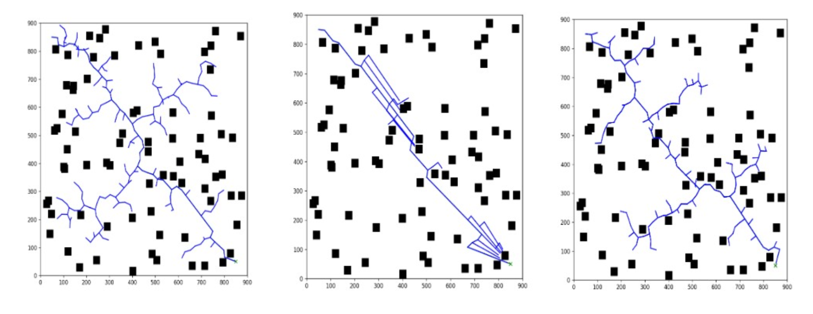

# Enhanced Path Planning with Expanding Path RRT* (EP-RRT*)

## Table of Contents
- [Abstract](#abstract)
- [Introduction](#introduction)
- [Key Features](#key-features)
- [Methodology](#methodology)
  - [Traditional RRT*](#traditional-rrt)
  - [Expanding Path RRT* (EP-RRT*)](#expanding-path-rrt-ep-rrt)
- [Experimental Results](#experimental-results)
- [Conclusion](#conclusion)
- [Authors](#authors)

## Abstract

Path planning is a fundamental aspect of robotics and autonomous systems, enabling efficient navigation through complex environments while avoiding obstacles. The **Expanding Path RRT*** (EP-RRT*) algorithm is an innovative extension of the traditional Rapidly-exploring Random Tree Star (RRT*) algorithm, specifically designed to enhance performance in complex and constrained environments. By employing heuristic sampling techniques, EP-RRT* improves exploration efficiency and accelerates convergence to optimal paths.

## Introduction

The RRT* algorithm and its variants are prevalent in the field of path planning due to their capacity to generate asymptotically optimal solutions. However, traditional RRT* algorithms may exhibit inefficiencies in specific environments, such as narrow corridors or densely packed obstacles, leading to longer computation times and suboptimal paths. The **Expanding Path RRT*** (EP-RRT*) addresses these limitations by integrating heuristic sampling strategies that prioritize exploration in regions likely to yield optimal paths.

## Key Features

- **Heuristic Sampling**: EP-RRT* incorporates heuristic-based sampling, inspired by the RRT-Connect algorithm, to guide exploration toward regions that facilitate faster path convergence.
  
- **Path Expansion**: The algorithm emphasizes the expansion of the most promising path segments, enhancing efficiency in environments with narrow or constrained spaces.

- **Improved Convergence**: EP-RRT* demonstrates superior performance over traditional RRT* in both convergence time and path quality by continuously refining the solution as exploration progresses.

- **Asymptotic Optimality**: Similar to RRT*, EP-RRT* ensures an optimal solution as the number of iterations increases while achieving enhanced performance in complex environments.

## Methodology

### Traditional RRT*

The RRT* algorithm is an iterative framework that constructs a random tree by sampling points from the search space and connecting them with edges that circumvent obstacles. While it guarantees improvement of the solution over time, its random sampling can hinder exploration efficiency, particularly in constrained environments.

### Expanding Path RRT* (EP-RRT*)

EP-RRT* builds upon the RRT* framework by implementing the following techniques:

1. **Heuristic Sampling**: Employing a heuristic approach akin to RRT-Connect’s greedy method, EP-RRT* biases its sampling toward areas more likely to yield optimal solutions, thereby prioritizing path segments that contribute to accelerated exploration and minimizing redundant sampling.

2. **Focused Path Expansion**: Rather than uniformly expanding the tree across all regions, EP-RRT* strategically expands paths in proximity to the goal or in regions that enhance the likelihood of optimal solution discovery. This significantly improves sampling efficiency in narrow or cluttered spaces.

3. **Collision Detection and Node Refinement**: Similar to traditional RRT*, EP-RRT* continuously checks for collisions between the robot and obstacles. The algorithm iteratively refines the paths, ensuring that the resultant path is both collision-free and optimal.

4. **Accelerated Convergence**: By concentrating on promising path segments and utilizing heuristic sampling, EP-RRT* achieves superior convergence rates compared to traditional RRT*. This capability is particularly evident in challenging environments such as long corridors and maze-like structures.

## Experimental Results

The EP-RRT* algorithm was evaluated in diverse environments to compare its efficacy with traditional RRT* and RRT-Connect. Below are the results from various experimental setups:

### 1. General Environment
A basic open space with minimal obstacles, showcasing the algorithm's general performance. In the image below, the first algorithm depicted from the left is RRT*, followed by RRT-Connect*, with the EP-RRT* algorithm showcased on the far right, highlighting the comparative performance of each approach. 

### 2. Cluttered Environment
A dense, obstacle-filled environment simulating urban settings. In the image below, the first algorithm depicted from the left is RRT*, followed by RRT-Connect*, with the EP-RRT* algorithm showcased on the far right, highlighting the comparative performance of each approach.

### 3. Narrow Corridor Environment
A long, thin passageway, designed to assess the algorithm's performance in constrained spaces. In the image below, the first algorithm depicted from the left is RRT*, followed by RRT-Connect*, with the EP-RRT* algorithm showcased on the far right, highlighting the comparative performance of each approach.

### 4. Maze Environment
A complex maze with multiple dead ends and pathways, testing the algorithm's efficiency to its limits. In the image below, the first algorithm depicted from the left is RRT*, followed by RRT-Connect*, with the EP-RRT* algorithm showcased on the far right, highlighting the comparative performance of each approach.

## Conclusion

The **Expanding Path RRT*** (EP-RRT*) algorithm offers significant advancements over traditional RRT* methods, particularly in environments characterized by long corridors, narrow pathways, and cluttered arrangements. By integrating heuristic sampling and focusing on efficient path expansion, EP-RRT* not only accelerates convergence but also enhances overall pathfinding efficacy. This positions EP-RRT* as a vital tool for real-world applications, including autonomous navigation in urban areas, search and rescue missions, and industrial robotics.

## Authors

- **Dhairya Shah** - UID: 120235146
- **Harsh Senjaliya** - UID: 120215575
